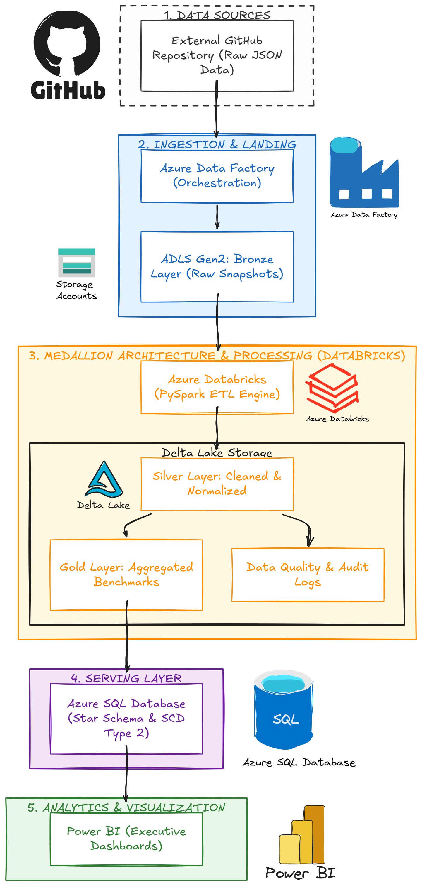

# Architecture — M&A Valuation Intelligence Platform

This document describes the end-to-end architecture of the M&A Valuation
Intelligence Platform, from external source data to executive-facing Power BI
dashboards. It is aligned with `architecture-diagram.png` in this directory —
the five numbered zones below correspond directly to the five zones in the
diagram.

Detailed schemas, business rules, and pipeline internals are intentionally
kept out of this document — see `docs/data-dictionary.md`,
`docs/data-quality.md`, `docs/business-rules.md`, and `docs/pipeline-design.md`
for that depth. This file answers one question: **what talks to what, and
why.**

## Architecture diagram : (from `architecture-diagram.png`)

The platform implements: **Ingest → Validate → Store → Transform → Curate →
Serve → Visualize**, following a Medallion Architecture (Bronze / Silver /
Gold) on Azure Data Lake Storage Gen2 and Delta Lake.

---

## Zone 1 — Data Sources

**Component:** External GitHub Repository (raw JSON)

- System of record: the publicly hosted **M&A Multiples Index** repository —
  treated as a source that changes over time, not a static file.
- Two resources are consumed:
  - `multiples.json` — valuation metrics by sub-vertical × EV bracket
  - `multiples-by-year.json` — time-series view of the same data, used for
    trend analysis
- No credentials required to read the source, but the retrieval URL and
  version are handled as configuration (Zone 2), never hard-coded.

---

## Zone 2 — Ingestion & Landing

**Components:** Azure Data Factory (orchestration) → ADLS Gen2 Bronze Layer

**Azure Data Factory — `PL_MA_Multiples_Ingestion`**

- Orchestration layer only — moves and stamps data, does not transform it.
- Connects to the source, retrieves both JSON files, writes them into ADLS
  Gen2 unmodified.
- Stamps ingestion metadata on each file.
- Triggers the downstream Databricks job.
- Logs execution status to the audit framework.
- Fully parameterized: source URL, storage account, container, dataset
  name, load type (`FULL` / `INCREMENTAL`), run date.
- Metadata-driven: reads an `etl_metadata` control table rather than
  hard-coding which files to pull, so new sources can be onboarded without
  a code change.
- Resilient: transient failures retry automatically; every run writes an
  audit record; a failure halts the downstream chain (Databricks → SQL →
  Power BI) instead of propagating bad data.
- Full parameter and audit-table definitions live in
  `docs/pipeline-design.md`.

**ADLS Gen2 — Bronze Layer**

- Stores source data exactly as received — no business transformation.
- Each ingestion run lands in its own dated partition
  (`ingestion_date=YYYY-MM-DD/`) rather than overwriting the previous load.
- Gives the platform data versioning and historical reproducibility.

---

## Zone 3 — Medallion Architecture & Processing (Databricks)

**Components:** Azure Databricks (PySpark ETL engine) over Delta Lake
Storage (Silver, Gold, Data Quality & Audit)

- Databricks is the platform's transformation engine — schema enforcement,
  JSON flattening, cleansing, validation, deduplication, standardization,
  and business transformations.
- Organized as five modular notebooks in `databricks/notebooks/`:
  `01_ingestion_validation` → `02_bronze_to_silver` → `03_silver_to_gold` →
  `04_data_quality` → `05_delta_merge`.

**Silver Layer**
- Flattens Bronze JSON into clean, analytical tables (valuation records,
  industry, EV bracket).
- Full column definitions live in `docs/data-dictionary.md`.

**Data Quality & Audit** (branches alongside Gold)
- Every Silver batch is validated: null checks, range/outlier rules,
  percentile consistency, deduplication, minimum deal-count thresholds.
- Results are written to an audit table that also feeds platform
  monitoring (Cross-Cutting Concerns, below).
- Full rule definitions live in `docs/data-quality.md`.

**Gold Layer**
- Curates Silver into business-ready, pre-aggregated datasets: industry
  valuation benchmarks, valuation trend, industry ranking, EV-bracket
  analysis.
- Each dataset is designed to answer a specific class of business
  question; table-by-table detail is in `docs/data-dictionary.md`.

**Delta Lake** (underpins all three sub-layers)
- ACID transactions, schema enforcement/evolution, partitioning, time
  travel.
- Incremental loads use **MERGE** (upsert on business key) — makes reruns
  idempotent, so the same pipeline run twice never duplicates business
  records.
- Time travel lets an analyst reproduce the dataset as it existed at any
  prior ingestion date — important since the source is continuously
  updated.

---

## Zone 4 — Serving Layer

**Component:** Azure SQL Database — Star Schema + SCD Type 2

- Relational serving layer for curated business data only — the raw/Bronze
  dataset is never dumped here, just Gold output.
- Modeled as a star schema: `FactValuation` surrounded by `DimIndustry`,
  `DimEVBracket`, `DimYear`, `DimMetric`.
- `DimIndustry` implements **SCD Type 2** to simulate industry
  classifications changing over time.
- Full DDL, keys, and column definitions live in `sql/` and
  `docs/data-dictionary.md`.

---

## Zone 5 — Analytics & Visualization

**Component:** Power BI — Executive Dashboards (`.pbix`, 4+ pages)

- Consumes the Azure SQL star schema directly.
- Exposed as a multi-page executive dashboard: overview, industry
  benchmarking, valuation trends, deal market intelligence.
- DAX-driven dynamic metric selection lets users toggle between EV/EBITDA
  and EV/Revenue without duplicate visuals.
- Page-by-page layout and DAX logic are documented alongside the `.pbix`
  file in `powerbi/`, not here.

---

## Cross-Cutting Concerns

**Security**
- Azure Key Vault holds all secrets.
- Managed Identity used for service-to-service auth wherever possible.
- Azure RBAC scopes access per service/role.
- No credentials are ever stored in plaintext in notebooks or pipeline
  JSON.

**Monitoring**
- Pipeline success rate
- Records processed / rejected
- Data quality score
- Processing duration
- Latest successful load
- Backed jointly by ADF's native monitoring and the Databricks
  audit/data-quality tables from Zone 3.

**Idempotency & Reproducibility**
- Reruns never create duplicate business records (Delta MERGE on business
  keys).
- Any historical state is reproducible from dated Bronze partitions plus
  Delta time travel.

---

## Component-to-Directory Map

| Architecture Zone | Repository Location |
|---|---|
| Zone 2 — ADF | `adf/pipelines/`, `adf/datasets/`, `adf/linked-services/`, `adf/triggers/` |
| Zone 3 — Databricks / Delta | `databricks/notebooks/`|
| Zone 4 — Azure SQL | `sql/control/`, `sql/ddl/`, `sql/dimensions/`, `sql/facts/`, `sql/views/` |
| Zone 5 — Power BI | `powerbi/dashboard.pbix`, `powerbi/screenshots/` |
| Supporting docs | `docs/data-dictionary.md`, `docs/pipeline-design.md`, `docs/data-quality.md`, `docs/business-rules.md` |

